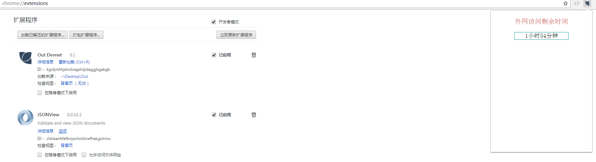

A Chrome Plugin to get access to public Internet within Devnet of Tencent.

## Source Tree

```
|-- Out
|   |-- content.js    //插件后台执行代码
|   |-- icon.png      //插件图标
|   |-- main.css
|   |-- manifest.json //插件配置
|   |-- Out.crx       //可以直接安装的插件
|   |-- popup.html    //点击插件的弹窗页面
|   |-- popup.js
|   `-- README.md
```
## Demo



具体细节参见 [写一个 Chrome 插件解决生活问题](http://fuzhii.com/2016/10/08/write-chrome-plugin/)
